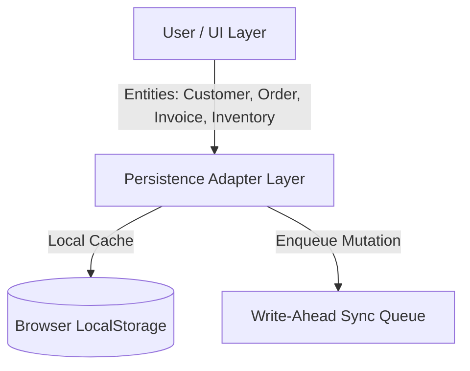
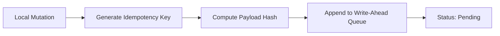
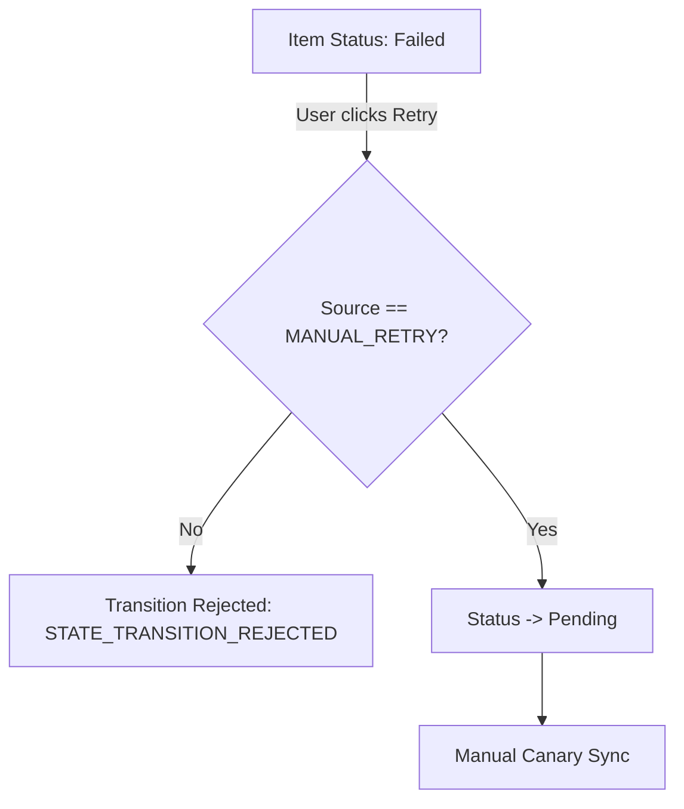
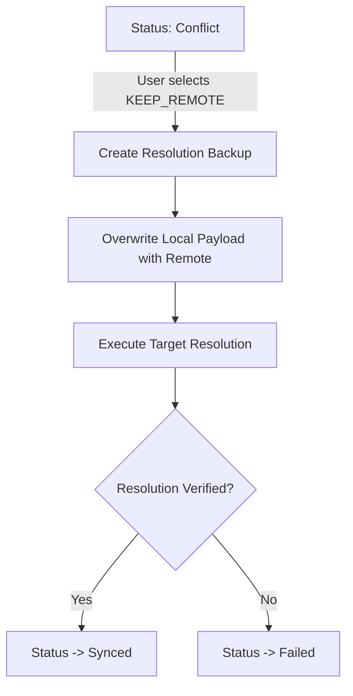
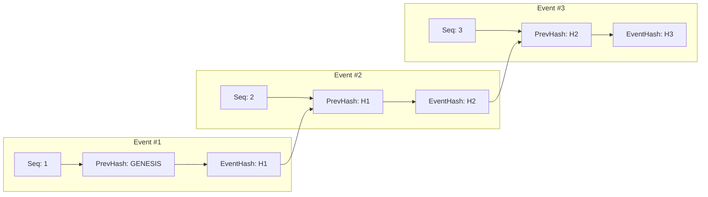
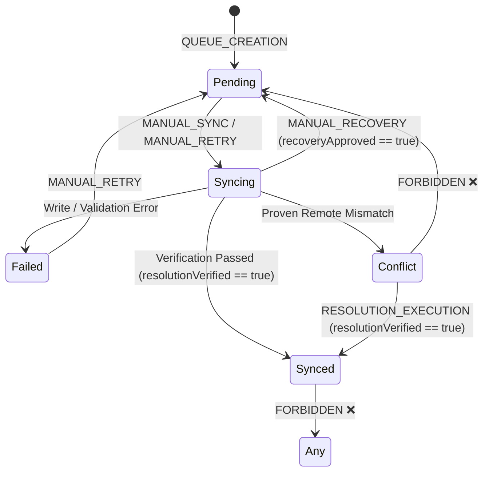

# Sync Architecture Version: 1.0
Status: FROZEN

No architectural changes are allowed without
a documented migration plan and compatibility review.

---

## 1. Project and Architecture Overview
The Atari Store Pro X synchronization subsystem provides an enterprise-grade, offline-first, manual-only data synchronization architecture designed for high integrity, deterministic state progression, tamper-evident audit logging, and safe conflict resolution.

All synchronization operations are user-driven (manual canary sync, manual retries, and manual conflict resolution). Automated background synchronization, background workers, automated retries, and bulk batch operations are strictly prohibited to prevent uncontrolled data mutation and cascading network failures.

---

## 2. Sync Architecture Version: 1.0
- **Architectural Specification**: Version 1.0
- **Scope**: Core Write-Ahead Queue, Local Storage Adapters, Preflight Verification, Canary Manual Sync, Exponential Backoff Manual Retry Policy, KEEP_REMOTE Resolution Execution with Pre-Resolution Backups, and SHA-256 Tamper-Evident Audit Hash Chain (Phase 2G.1).

---

## 3. Architecture Status: FROZEN
This architecture is formally marked as **FROZEN**. No core state machine rule changes, automatic execution workers, or data structure mutations are permitted without a formal architectural proposal, comprehensive compatibility review, and explicit migration strategy.

---

## 4. Data Layer
The data layer governs business entity types synchronized across client and remote storage engines:
- **Supported Entities**: `Customer`, `Order`, `Invoice`, `Inventory`.
- **Supported Operations**: `CREATE`, `UPDATE`, `DELETE`.
- **Payload Integrity**: Every entity payload is assigned a deterministic SHA-256 payload hash (`payloadHash`) calculated upon queue insertion.

---

## 5. Persistence Adapter Layer
Provides abstract interfaces to standard browser storage (`localStorage` / memory fallback):
- Ensures atomic write operations for sync queue items, audit events, conflict history records, and pre-resolution state backups.
- Features automatic fallback to memory when `localStorage` is disabled or restricted.

---

## 6. Validation Layer
Strictly validates payload structure and state transitions before queue entry or network execution:
- **Payload Validation**: Verifies entity presence, valid operation types (`CREATE`, `UPDATE`, `DELETE`), non-empty IDs, and payload schema correctness.
- **Idempotency Key Verification**: Ensures unique idempotency keys (`${entityType}:${entityId}:${operation}`) to prevent duplicate entity queueing.

---

## 7. Write-Ahead Sync Queue
Operating as a durable write-ahead log (WAL) for local mutations:
- **Queue Item Structure**: `id`, `entityType`, `entityId`, `operation`, `payload`, `payloadHash`, `status`, `retryCount`, `createdAt`, `updatedAt`, `version`, `idempotencyKey`, `sequenceNumber`.
- **Item Statuses**: `Pending`, `Syncing`, `Synced`, `Failed`, `Conflict`.

---

## 8. Remote Preflight
Executes non-mutating remote environment checks before attempting any write:
- **Verifications**: Validates API key configuration, server reachability (`/api/health`), and remote target entity existence/version check.
- **Preflight Failure**: Blocks synchronization immediately and sets queue status to `Failed` or `Conflict` without executing mutating payload payloads.

---

## 9. Manual Canary Sync
Enforces strict single-item manual canary execution:
- Only **one** item is processed at a time (`canarySync`).
- **No Bulk Sync**: Batch syncing of multiple items simultaneously is forbidden.
- **Atomic Locking**: Item status transitions atomically `Pending` -> `Syncing`.

---

## 10. Manual Retry Policy
Controls failed queue items:
- **No Auto Retry**: Background timer retries are disabled.
- **User Triggered**: Retries must be initiated manually by explicit user action in the UI (`MANUAL_RETRY`).
- **Exponential Backoff Guidance**: Calculates suggested wait intervals based on `2^retryCount * 1000ms` (capped at 60s), enforced visually in the user interface.

---

## 11. Conflict Inspection
Triggers when a remote version or data mismatch is detected during preflight or remote execution:
- Generates a `ConflictRecord` containing `localPayload`, `remotePayload`, `detectedAt`, `entityType`, `entityId`, and `status`.
- Transitions queue item to `Conflict` state.
- Halts pipeline processing for the item until user inspects and selects a resolution plan.

---

## 12. KEEP_REMOTE Conflict Resolution
The primary supported conflict resolution strategy in Phase 2:
- Overwrites the local entity state with the remote server version.
- Replaces the local queue item payload with the remote payload.
- Creates a mandatory state backup prior to overwrite execution.

---

## 13. Resolution Backup and Verification
- **Pre-Resolution Backup**: Saves a snapshot (`ResolutionBackup`) of both local and remote states before applying any resolution.
- **Post-Resolution Verification**: Re-reads and re-validates the target entity post-write (`resolutionVerified == true`).
- **State Transition Guard**: `Conflict` -> `Synced` is **ONLY** allowed if `source == RESOLUTION_EXECUTION` AND `resolutionVerified == true`.

---

## 14. Audit System
Comprehensive, append-only event logging subsystem:
- **Append-Only Storage**: Modifying or deleting logged audit events is strictly forbidden.
- **Deep Immutability**: All logged events and queries pass through `deepClone()` and `deepFreeze()` to prevent pointer mutation or caller object alteration.

---

## 15. Correlation ID Lifecycle
- Every sync workflow is assigned a unique `correlationId` (e.g. `CORR-1722000000000-abc12`).
- Links all associated lifecycle events (`QUEUE_CREATED`, `PREFLIGHT_STARTED`, `SYNC_STARTED`, `SYNC_SUCCEEDED`, `CONFLICT_DETECTED`, `RESOLUTION_COMPLETED`) across the pipeline timeline.

---

## 16. Tamper-Evident Hash Chain
Each `AuditEvent` forms a cryptographically linked SHA-256 hash chain:
- **Chain Metadata**: `sequenceNumber`, `previousEventHash`, `eventHash`, `schemaVersion`.
- **First Event**: `previousEventHash = 'GENESIS'`.
- **Subsequent Events**: `previousEventHash = previousEvent.eventHash`.
- **Hash Computation**: SHA-256 hash calculated over deterministic canonical serialization of all event properties (excluding `eventHash` itself).

---

## 17. Canonical Serialization Rules
Deterministic stringification (`canonicalizeAuditEvent`) enforces:
1. **Sorted Keys**: Object keys sorted alphabetically at every nesting level.
2. **Preserved Arrays**: Array element order preserved exactly.
3. **Explicit Nulls**: `null` values preserved explicitly.
4. **Stripped Undefined/Functions/Symbols**: `undefined`, functions, and symbols removed or mapped deterministically.
5. **Number Normalization**: Special values (`NaN`, `Infinity`, `-Infinity`) stringified deterministically.

---

## 18. State Machine Rules
The transition engine (`validateTransition`) enforces strict state flow guards:

### Transition Enforcement Matrix:
- **Undefined -> Pending**: Allowed ONLY on queue creation (`source == QUEUE_CREATION`).
- **Pending -> Syncing**: Allowed ONLY via manual actions (`MANUAL_SYNC` or `MANUAL_RETRY`).
- **Syncing -> Synced**: Allowed ONLY when `resolutionVerified == true`.
- **Syncing -> Failed**: Allowed on execution or validation errors.
- **Syncing -> Conflict**: Allowed when remote mismatch is verified.
- **Syncing -> Pending**: Allowed ONLY when `source == MANUAL_RECOVERY` AND `recoveryApproved == true`.
- **Failed -> Pending**: Allowed ONLY via `MANUAL_RETRY`.
- **Conflict -> Synced**: Allowed ONLY when `source == RESOLUTION_EXECUTION` AND `resolutionVerified == true`.
- **Conflict -> Pending**: **FORBIDDEN ALWAYS**.
- **Synced -> Any State**: **FORBIDDEN ALWAYS** (Terminal State).

Any rejected transition logs a `STATE_TRANSITION_REJECTED` audit event without mutating queue item state.

---

## 19. Sync Health Score
Calculates system health dynamically on a 0-100% scale starting from 100:
- **Failed Items Penalty**: `min(30, failedCount * 6)`
- **Conflict Items Penalty**: `min(25, conflictCount * 5)`
- **Stale Syncing Penalty**: `min(30, staleSyncingCount * 10)`
- **Old Pending Penalty**: `min(15, oldPendingCount * 3)`
- **Success Rate Penalty**: If success rate < 95%, deduct `min(20, (95 - successRate) * 0.5)`
- **Performance Penalties**:
  - Sync Duration > 2000ms (+2), > 5000ms (+5), > 10000ms (+10)
  - Retry Duration > 3000ms (+2), > 8000ms (+5)
  - Resolution Duration > 5000ms (+2), > 15000ms (+5)
- **Data Quality Safeguard**: If queue and audit log are empty, displays `INSUFFICIENT_DATA` rather than artificial 100% perfection.

---

## 20. Diagnostics and Audit Explorer
- **Audit Explorer UI**: Provides real-time visibility into correlation ID timelines, hash chain status, state transitions, and health metrics.
- **Diagnostic Verifier (`verifyAuditChain`)**: Diagnoses chain integrity (`HASH_MISMATCH`, `PREVIOUS_HASH_MISMATCH`, `SEQUENCE_GAP`, `DUPLICATE_SEQUENCE`, `INVALID_GENESIS`, `INVALID_EVENT_SCHEMA`). Diagnostic only — never auto-repairs logs.

---

## 21. Legacy Audit Migration Strategy
- Pre-existing audit logs lacking hash chain fields are categorized as `isLegacyUnverified = true` with `previousEventHash = 'LEGACY_UNVERIFIED'`.
- Legacy events are preserved intact without deletion or rewriting.
- A new valid Hash Chain commences seamlessly after legacy logs with `sequenceNumber = 1` and `previousEventHash = 'GENESIS'` or an explicit `AUDIT_CHAIN_STARTED` marker event.

---

## 22. Supported Features
- [x] Manual Write-Ahead Queueing with Payload SHA-256 Hashing.
- [x] Manual Single-Item Canary Synchronization.
- [x] Preflight Server Reachability & Version Mismatch Checks.
- [x] Manual Retries with Exponential Backoff Guidance.
- [x] Pre-Resolution Snapshot Backups.
- [x] KEEP_REMOTE Conflict Resolution with Post-Write Verification.
- [x] Cryptographic SHA-256 Hash Chain Audit Logging with Correlation ID Tracking.
- [x] Deep Immutability (`deepClone` + `deepFreeze`) for Audit Logs.
- [x] Hardened State Machine Machine Rule Engine.
- [x] Health Score Engine with Data Quality Detection.

---

## 23. Unsupported Features
- [ ] Auto Synchronization (Background / Timers).
- [ ] Automated Background Retries.
- [ ] Background Web Workers or Service Workers.
- [ ] Bulk / Batch Queue Synchronization.
- [ ] Automatic Audit Log Repair or Auto-Re-Hashing.
- [ ] Direct Transition `Conflict` -> `Pending`.
- [ ] Unverified Transitions `Syncing` -> `Synced` or `Conflict` -> `Synced`.

---

## 24. Safety Guarantees
1. **Zero Uncontrolled Mutations**: All network synchronization and retries require explicit manual user triggers.
2. **Immutable Audit History**: Audit records cannot be altered, updated, or deleted. Deep freezing blocks in-memory object tampering.
3. **Tamper-Evident Chain**: Any manual alteration of stored audit JSON breaks the SHA-256 hash link and is detected immediately by `verifyAuditChain()`.
4. **Terminal Synced State**: Once an item is marked `Synced`, it can never re-enter `Pending`, `Syncing`, `Failed`, or `Conflict`.
5. **Pre-Resolution Data Preservation**: State backups are captured prior to executing any overwrite resolution.

---

## 25. Future Migration Rules
1. Any modification to `SYNC_ARCHITECTURE_v1.md` requires a formal proposal, security review, and backwards compatibility verification.
2. Introduction of auto-sync or bulk operations requires upgrading to Architecture Version 2.0 and implementing server-authoritative distributed locking.
3. Legacy audit logs must remain permanently readable and marked `LEGACY_UNVERIFIED`.
